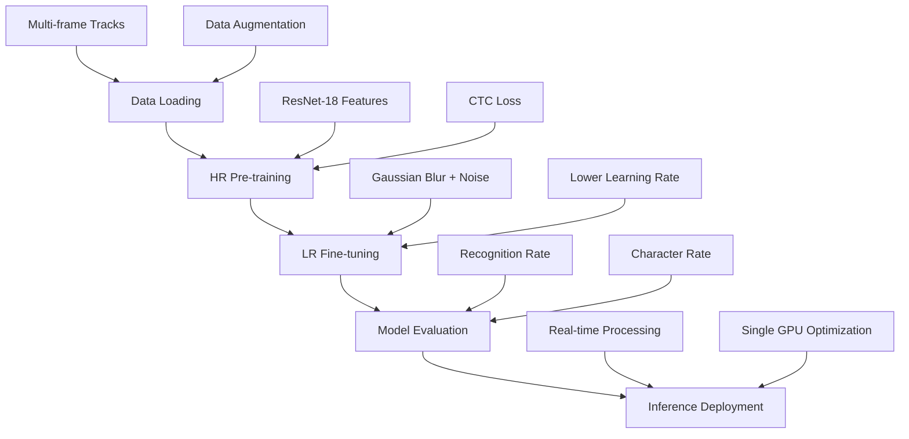

# ICPR 2026 Temporal CRNN License Plate Recognition Project Plan

## Project Overview

This project implements a Temporal Convolutional Recurrent Neural Network (CRNN) for license plate recognition, specifically designed to handle low-resolution (LR) license plate images by leveraging temporal information from multiple frames in a video track. The system is trained on Brazilian and Mercosur license plate datasets for the ICPR 2026 competition.

## Current Status

### ✅ Completed Components

- **Dataset Implementation** (`src/dataset.py`):
   - LicensePlateDataset class for loading multi-frame tracks
   - Support for HR (High-Resolution) and LR (Low-Resolution) training modes
   - Data augmentation for LR training (Gaussian blur, noise)
   - Character encoding for alphanumeric license plates (A-Z, 0-9)
   - Train/validation split functionality
   - Corner coordinates loading from annotations

- **Model Architecture** (`src/model.py`):
   - Temporal CRNN with ResNet-18 backbone (pre-trained)
   - Temporal fusion via frame averaging
   - Bi-directional LSTM for sequence modeling
   - CTC (Connectionist Temporal Classification) loss for sequence prediction

- **Training Pipeline** (`train.py`):
   - Two-phase training: HR pre-training followed by LR fine-tuning
   - CTC loss implementation with proper target formatting
   - Model weight saving/loading functionality
   - Train/validation split with separate dataloaders
   - Early stopping based on validation recognition rate

- **Evaluation Metrics** (`src/metric.py`):
   - Recognition Rate (exact plate match accuracy)
   - Character Recognition Rate (individual character accuracy)

- **Data Structure**:
   - Brazilian license plates with 5-frame tracks each
   - Separate HR and LR images per track
   - JSON annotations with plate text and corner coordinates
   - EDA visualizations for character distributions

- **Dependencies** (`pyproject.toml`):
   - Added deep learning dependencies (torch, torchvision, timm, numpy)

### ⚠️ Known Issues & Incomplete Features

- **Inference Pipeline**: No dedicated inference script for deployment
- **Model Evaluation**: Limited evaluation on unseen data
- **Hyperparameter Tuning**: No systematic hyperparameter optimization
- **Cross-Validation**: No k-fold cross-validation implementation
- **Data Expansion**: Dataset currently loads only Brazilian plates; Mercosur plates not included
- **Synthetic Data**: No synthetic data generation for rare characters
- **Advanced Evaluation**: No per-character analysis or confusion matrix
- **Deployment**: No optimization, API, or integration features

## Pipeline Overview



### Training Phases

1. **HR Pre-training** (10 epochs, lr=1e-3):
   - Train on high-resolution images
   - Learn general plate recognition features
   - Save HR-pretrained weights

2. **LR Fine-tuning** (20 epochs, lr=1e-4):
   - Fine-tune on low-resolution images with augmentation
   - Adapt to degraded image conditions
   - Save final model weights

## Next Steps

### Immediate Priorities

1. **Fix Dataset Issues**:
    - Correct corner coordinate handling: either load from annotations or remove from return values
    - Ensure proper loading of annotation data
    - Add dependencies to pyproject.toml (torch, torchvision, timm, etc.)

2. **Add Validation Pipeline**:
    - Implement train/validation split
    - Add early stopping based on validation metrics
    - Monitor overfitting during training

3. **Complete Training**:
    - Run full training pipeline on available data
    - Evaluate model performance on held-out sets
    - Generate performance reports

4. **Hyperparameter Optimization**:
    - Grid search or random search for optimal parameters
    - Experiment with different learning rates, batch sizes
    - Test alternative temporal fusion methods

### Medium-term Goals

5. **Model Improvements**:
   - Implement cross-validation for robust model selection
   - Experiment with different backbone architectures using timm library (ResNet-50, EfficientNet, etc.)
   - Try alternative temporal fusion (attention, LSTM-based)
   - Implement ensemble methods

6. **Data Expansion**:
   - Ensure dataset loads all scenarios from data/train/ (Scenario-A and Scenario-B)
   - Include Mercosur license plates in training
   - Add more diverse scenarios (different lighting, angles)
   - Synthetic data generation for rare characters

7. **Advanced Evaluation**:
   - Per-character accuracy analysis
   - Confusion matrix for character recognition
   - Performance across different degradation levels
   - Cross-validation performance metrics

## Deployment Considerations

### Target Environment

- **Hardware**: Single GPU setup (as specified)
- **Use Case**: Real-time license plate recognition in surveillance systems
- **Performance Requirements**: Low latency for live processing

### Technical Requirements

1. **Inference Optimization**:
   - Model quantization for faster inference
   - ONNX export for cross-platform deployment
   - Batch processing capabilities

2. **API Design**:
   - RESTful API for plate recognition requests
   - Input: Multi-frame image sequences
   - Output: Recognized plate text with confidence scores

3. **Integration Points**:
   - Camera feed integration
   - Database storage for recognized plates
   - Alert system for specific plates

### Performance Metrics

- **Latency**: <100ms per frame sequence
- **Throughput**: >10 FPS on target hardware
- **Accuracy**: >90% recognition rate on LR images
- **Memory**: <2GB GPU memory usage

## Folder Structure

```
├── data/
│   ├── train/
│   │   ├── Scenario-A/
│   │   │   ├── Brazilian/      # Contains track directories with hr/lr images and annotations
│   │   │   └── Mercosur/       # Contains track directories with hr/lr images and annotations
│   │   └── Scenario-B/
│   │       ├── Brazilian/      # Contains track directories with hr/lr images and annotations
│   │       └── Mercosur/       # Contains track directories with hr/lr images and annotations
│   └── test/                   # To be created
├── src/
│   ├── dataset.py              # Dataset loading and preprocessing (implemented)
│   ├── model.py                # Temporal CRNN architecture (implemented)
│   ├── metric.py               # Evaluation metrics (implemented)
│   └── inference.py            # To be created - inference pipeline
├── eda/
│   ├── *.png                  # EDA visualization images (generated)
│   └── data_analysis.ipynb     # To be created
├── weights/                    # Empty - model weights to be saved here
├── configs/                    # Empty - configuration files to be created
├── scripts/                    # Empty - shell scripts to be created
├── tests/                      # Empty - test files to be created
├── plans/
│   └── project_plan.md         # This document
├── pyproject.toml              # Basic dependencies defined
├── requirements.txt            # To be created with full dependencies
├── train.py                    # Training script (implemented)
├── test_training.py            # Test script for training (implemented)
├── README.md                   # Project documentation
└── uv.lock                     # Dependency lock file
```

## Risk Assessment

### Technical Risks

- **Data Quality**: Limited diversity in training data may affect generalization
- **Model Complexity**: Current architecture may be overkill for single GPU deployment
- **Performance Bottlenecks**: Temporal processing may increase inference latency

### Mitigation Strategies

- Implement data augmentation and synthetic generation
- Profile model performance and optimize bottlenecks
- Consider lighter architectures for edge deployment

## Success Criteria

- **Training**: Successfully complete two-phase training without errors
- **Accuracy**: Achieve >85% recognition rate on LR test set
- **Deployment**: Deployable model with <50ms inference time
- **Maintainability**: Clean, documented codebase with tests

## Timeline

- **Week 1**: Fix dataset issues, add validation pipeline
- **Week 2**: Complete full training and evaluation
- **Week 3**: Optimize for deployment, create inference pipeline
- **Week 4**: Final testing and documentation

---

*This plan will be updated as the project progresses and new requirements emerge.*